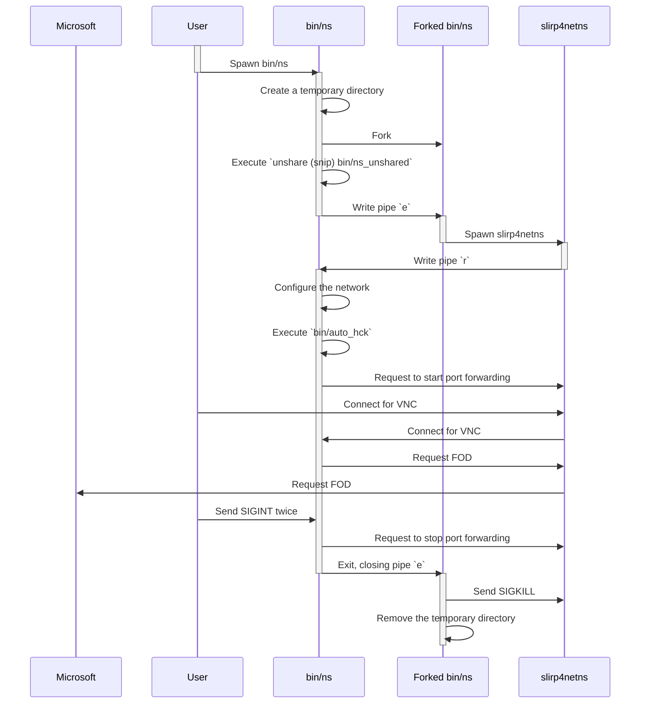

# Network Namespace Design

https://github.com/HCK-CI/AutoHCK/pull/150 introduced network namespace to remove root requirement, isolate network constructs from the host, and make the network configuration reproducible.

The below describes the concepts related to network namespace implementation, involved tools, and an example of an execution sequence.

This description of this documentation is as of the date when the change was introduced.

## Concepts

### Network bridge

A network _bridge_ is basically a virtual L2 switch. The _taps_ in a bridge are connected with each other, and the bridge passes IP packets among them.
A bridge is globally scoped, uniquely identified with string identifiers, and it persists until the system reboots or it is explicitly removed. This nature of bridges makes managing them difficult.
As bridges has no concept of ownership, managing bridges requires CAP_NET_ADMIN capability (i.e. sudo everywhere).

## Namespace

_Namespace_ is the fundamental idea of this change. It creates an isolated environment for global resources. In this case, network namespace plays the critical role to create an isolated environment for bridges. Container runtimes like Docker are based on complex combinations of namespace and other constructs like cgroups, but it is also possible to use some namespace construct selectively and to create a semi-isolated environment.

Namespace is hierarchical. The system starts with the root namespace. Creating a namespace divides the world into the outer namespace and the inner namespace. It is also possible to nest namespaces.

Creating a namespace does not require a privilege.

## Tools

These are the main tools this change uses.

### `unshare`

`unshare` creates namespaces and executes a command in the namespace. This change creates the following namespaces:
- `user` namespace as it is required by `net` namespace. With `user` namespace, it is possible to run a command as a root in the inner namespace even if you don't have the capability in the outer namespace.
- `net` namespace to create bridges in an isolated environment.
- `mount` namespace to override `/etc/resolv.conf` to point to slirp4netns.

### `slirp4netns`

`slirp4netns` is a daemon for network namespace. The below is the roles of slirp4netns.

- Gateway to provide connectivity from the inner namespace to the outer namespace. An alternative way to provide such connectivity is to have `veth`s, virtual L2 ports that can cross namespace boundaries. veth more efficient as it is a kernel-space mechanism, but managing veth for the outer namespace has the same difficulty with bridges. 
- Forwarder from the outer namespace to the inner namespace. slirp4netns listens to ports in the outer namespace, and forwards packets to them to the inner namespace. The forwarding configuration can be altered at runtime with a Unix domain socket slirp4netns listens to.
- DNS server. Some system has an internal DNS server to e.g. forward unencrypted queries via DNS-over-TLS, but the inner namespace cannot connect to the server by default. In the case, slirp4netns can forward queries to the outer namespace.
- DHCP server.

### `ip`

`ip` is a generic network management command. Before this change, some specific tools, namely `brctl` and `ifconfig` were used to manage different network constructs, but they are now managed by `ip` since `ip` is necessary to configure routes anyway.

## Diagram

The below describes the sequence to start installing a Windows image and aborting it.

